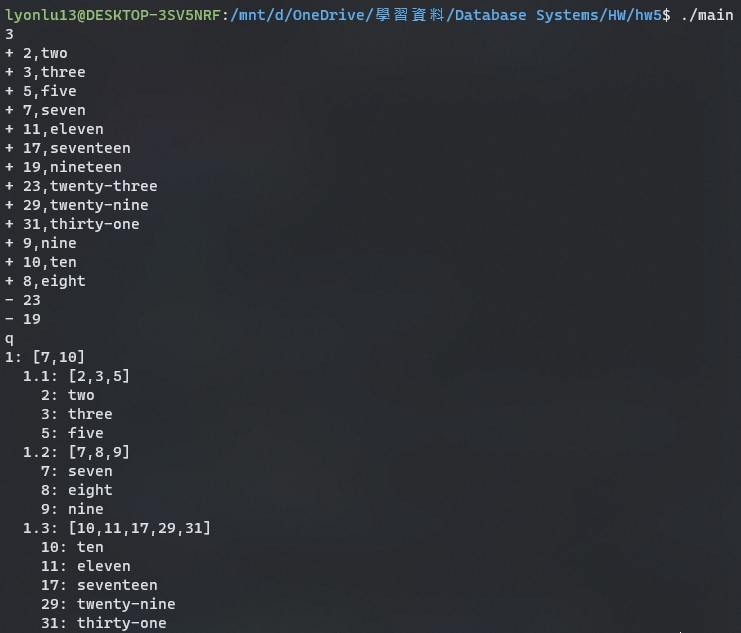
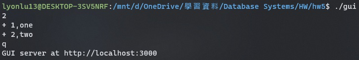
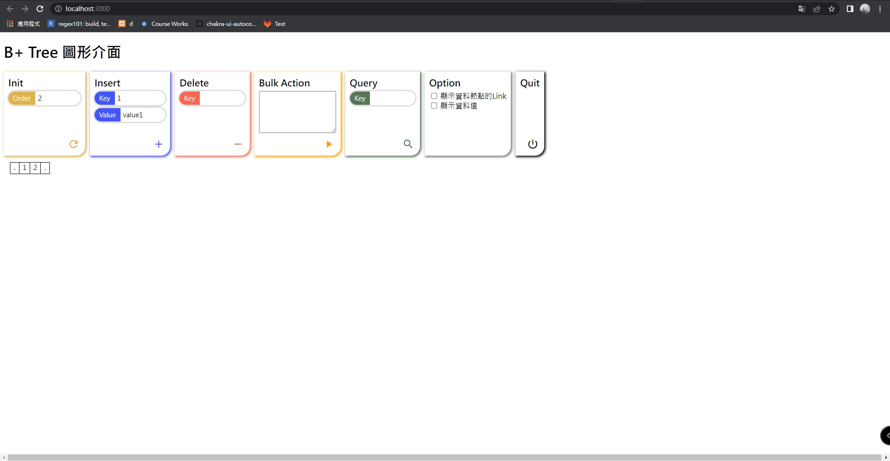
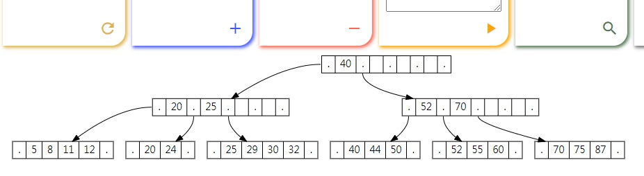
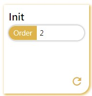
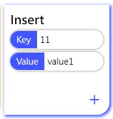
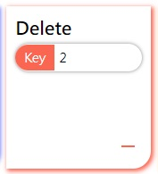
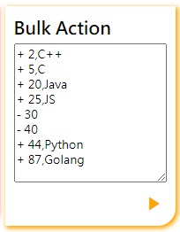
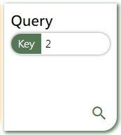

# B+ Tree

> 409410047 呂耀承 lyonlu13@gmail.com

## 使用的程式語言及版本

    語言: C++
    編譯器: g++ (Ubuntu 9.4.0-1ubuntu1~20.04) 9.4.0
    
    開發過程中使用WSL進行測試

## 操作說明

若在Linux環境之下，可直接下達make指令編譯。
Windows 環境下則只能編譯基礎版本：
`g++ b_plus.cpp main.cpp -o main -g`

### A. 基礎版本 main

> 僅使用終端機stdin/out

1. `$ ./main` 開啟程式
2. 輸入 order
3. 插入與刪除與投影片之格式相同
   - `+ <key>,<value>`
   - `- <key>`
4. 若輸入完畢，可送出任意字元(例如:q)以結束輸入，或在linux系統下ctrl+d
5. 結束後會顯示B+ Tree的內容，與投影片之格式相同
   
   
   ### B. 圖形界面版本 gui
   
   > 網頁圖形化界面。注意：僅支援Linux系統(可使用WSL)
6. `$ ./gui` 開啟程式
7. 初始化 B+ Tree，輸入方式與基礎版本相同
8. 輸入完畢後可看到伺服器啟動提示
   
9. 至瀏覽器輸入網址`localhost:3000`即可開啟介面，若通訊埠有衝突，需要麻煩助教修改原始碼 gui.cpp 中的 `svr.listen("localhost", 3000);` 再行編譯
   
10. B+ Tree 圖形顯示在下方，可透過滑鼠縮放移動，某些操作會導致圖形偶爾會消失，為套件的bug，重整頁面即可恢復正常。
    
11. Init 區段可重製一顆指定order的tree，只需輸入order，並按下右下鍵即可。特殊功能：若order為-100，送出後程式會在終端機界面以投影片格式當前的B+ tree  
    
12. Insert 區段可插入資料，key必須為整數  
    
13. Delete 區段可刪除資料，key必須為整數  
    
14. Bulk Action 區段可進行批量操作，輸入格式同標準輸入界面  
    
15. Query 區段可進行資料查詢，key必須為整數  
    
16. Option 區段可調整繪圖選項，可選擇是否顯示資料值與雙向鏈結  
    
17. Quit 區段可關閉GUI伺服器  
    

## 參考

- https://www.cs.usfca.edu/~galles/visualization/BTree.html (觀察 B+ Tree 的行為)
- http://ysangkok.github.io/js-clrs-btree/btree.html (參考 graphviz 語法)
  
  ## 使用套件
- https://github.com/yhirose/cpp-httplib (cpp-httplib/HTTP 伺服器/c++)
- https://d3js.org/ (D3.js/d3-graphviz的相依套件/js)
- https://github.com/magjac/d3-graphviz (d3-graphviz/繪圖套件，用於輸出B+ Tree/js)
- https://developers.google.com/fonts/docs/material_icons (好看的 Icon)

## Bonus

1. display功能以圖形呈現
   - 繪製出樹狀圖
   - 標記節點pointer與對應children
   - 可顯示雙向鏈結
   - 可顯示資料鍵與資料值
2. 圖形化的介面
   - 網頁介面，透過http api與c++溝通
   - 初始化
   - 插入
   - 刪除
   - 批量操作(每次插入、刪除為獨立動作)
   - 資料查詢
   - 繪圖選項
3. Delete merging、re-distribution
   - 當刪除後資料量(或key的數量) < order，對節點進行合併與重新分配
4. 相同key之data的統整蒐集
   - 允許插入相同的key

## 伺服器API

GET /init?order=[order]

- 初始化一顆指定 order 的 B+ Tree

GET /insert?key=[key]&value=[value]

- 插入資料

GET /delete?key=[key]

- 刪除資料

GET /graph

- 獲取B+ tree 的 graphviz 語法

GET /query?key=[key]

- 尋找指定key所代表的資料

POST /bulk

- 批量操作
- 指令放在request body中

GET /stop

- 停止伺服器

insert、delete、graph、bulk，都會回傳更新後的圖，可附帶data、link參數以決定是否繪製資料值與雙向鏈結